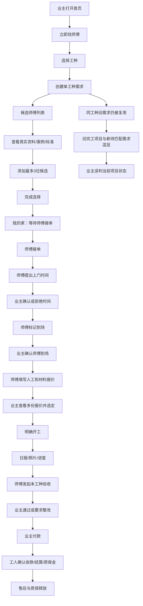
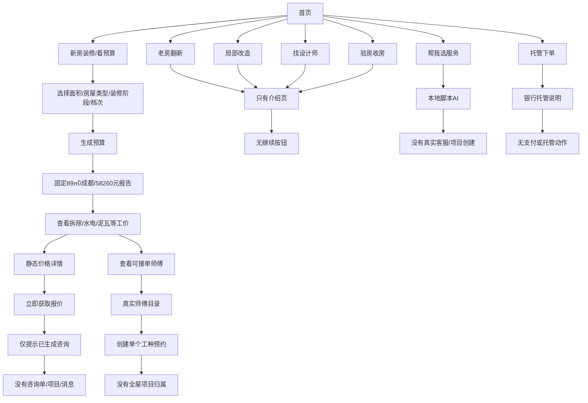

# 知底业主端闭环与视觉审计（2026-08-08）

## 1. 审计范围与现场环境

- 视角：真实业主首次使用，从发现服务到完工、验收、付款、售后。
- 主流程：
  1. 业主直接找师傅。
  2. 新房装修/全屋翻新。
- 现场设备：业主端 `emulator-5556`，工人端 `emulator-5554`。
- 服务器：`http://47.109.0.191:8080`，审计时健康状态为 `UP`。
- 方法：在当前运行安装包中逐页点击，同时对照当前源码、接口和测试；关键状态均保存了本轮截图。
- 截图目录：`zhidi_app/output/audits/owner-product-audit-20260807/`。

状态标记：

- ✅：真实服务端链路可继续。
- ⚠️：局部可用，但不能独立形成完整闭环。
- ❌：断路、错误状态或与真实业务不一致。
- 🟣：静态说明页。
- 🟠：本地 Mock、硬编码或假成功。

## 2. 总结结论

### 2.1 直接找师傅

当前已经具备一条“部分真实”的业务链：

`选工种 → 看真实师傅 → 添加候选 → 师傅接单 → 提议上门 → 业主确认 → 双方确认到场`

上述步骤本轮均在双模拟器和生产服务器上真实跑通。

现场记录最初看起来像“提交报价后直接跳到已完成、已支付”，但复核页面 XML、源码和生产数据库后确认：首次打开报价页时合计为 0、项目均未勾选；随后同一 booking 的报价被接受、验收通过、付款申报并由工人确认收款。因此“报价页自动带出历史数量”和“提交报价自动完成付款”不是已证实缺陷。

已经证实的最高优先级问题是：后端会按业主、工种和城市复用旧的 OPEN 需求，业主端又会在顶部工作台和下方需求列表分别选择不同的同工种 request，导致旧的已完成/已付款项目与新的待匹配需求在同一屏混显。该问题会让业主误以为新需求已经完成或支付，因此当前仍不能认定闭环稳定。

### 2.2 全屋翻新

当前没有真实的“全屋翻新项目”。现在是两条不相连的链：

- “新房装修/看预算”：本地表单 + 固定预算报告。
- “找师傅”：每次只创建一个工种的独立需求。

两条链之间没有全屋项目 ID，也没有统一的房屋信息、工种计划、总预算、总进度、分阶段验收和项目级结算。

### 2.3 产品可信度

当前最大的风险不是页面数量不足，而是部分页面“看起来已经上线”，实际却是静态、Mock 或旧版本地流程。例如：

- 银行托管、在线人数、响应时间、认证、评分、成交量和保障承诺存在硬编码或未接通情况。
- 师傅详情有两套实现；收藏入口进入旧版硬编码详情。
- 师傅详情中的“客服/联系师傅”在合作前实际打开本地 AI，不是真实师傅聊天。
- 价格详情“立即获取报价”只显示提示，不生成咨询单。
- 老房翻新、局部改造、找设计师、验房只有介绍，无下一步。

在小范围真实业主测试前，应先移除假成功和无法兑现的信任文案。

## 3. 树状导图一：业主直接找师傅



### 3.1 按步骤的现场结果

1. ✅ 首页“立即找师傅”能进入工种页。
2. ✅ 点击木工后会创建真实服务需求。
3. ✅ 候选页显示服务器中的真实工人李德发。
4. ✅ 综合排序、经验优先、看案例均可切换。
5. ⚠️ “看案例”实际按资料完整度排序，不是按案例数量。
6. ⚠️ “可预约”看起来像筛选按钮，但不可点击。
7. ✅ 查看详情可打开真实师傅资料。
8. ✅ 收藏和系统分享可用。
9. 🟣 施工标准页可切换安全、工艺、材料、验收四个静态标签。
10. ❌ 详情页“客服”打开的是本地 AI，并把标题伪装成师傅姓名和“在线”。发送消息没有真实师傅回复。
11. ✅ “添加为候选”真实写入服务器。
12. ✅ “完成选择”回到“我的家”，显示待接单。
13. ✅ 工人端能收到新需求并接单。
14. ✅ 工人提出上门时间后，业主端出现确认/拒绝/取消。
15. ✅ 业主确认时间后，工人端可标记到场。
16. ✅ 业主端可确认师傅已到场。
17. ❌ 到场后“上门时间”被改成实际到场时间，原预约时间消失，计划时间和实际时间没有分开保存。
18. ✅ 工人端可进入人工费用、材料费用报价表。
19. ✅ 首次报价页的原始 XML 显示合计 ¥0、项目均未勾选；后续数量来自现场继续输入，未发现自动恢复旧报价草稿。
20. ✅ 数据库确认同一 booking 的报价在 15:23:01 被接受，验收在 15:24:39 通过，付款在 15:25:55 由工人确认；完成/付款状态有对应业务动作。
21. ❌ 业主端顶部仍可能显示旧的已完成/已支付项目，而下方同工种新需求显示待匹配，两个 request 被组合成一屏，项目身份不一致。
22. ⚠️ 单条 booking 的报价、验收和线下付款状态能够推进，但旧需求复用与混显会干扰连续复测，必须先修复后再做完整回归。

关键现场截图：

- [候选师傅已选中](../zhidi_app/output/audits/owner-product-audit-20260807/10b-candidate-selected.png)
- [业主等待接单](../zhidi_app/output/audits/owner-product-audit-20260807/11-after-complete-selection.png)
- [师傅提出上门时间](../zhidi_app/output/audits/owner-product-audit-20260807/14b-worker-propose-time.png)
- [师傅报价表现场输入后的状态](../zhidi_app/output/audits/owner-product-audit-20260807/19b-worker-quote-selected.png)
- [该 booking 完成报价、验收和付款后的完工档案](../zhidi_app/output/audits/owner-product-audit-20260807/19c-worker-quote-cleaned.png)

## 4. 树状导图二：新房装修/全屋翻新



### 4.1 现场结果

1. ✅ 新房装修表单可以选择面积、普通住宅/公寓/别墅、毛坯/精装、装修档次。
2. ❌ 选择结果没有传给预算页。报告固定显示 89㎡、毛坯房、简约装修、¥58,260。
3. 🟣 预算拆分和工价目录是本地静态数据。
4. 🟠 价格详情“立即获取报价”只出现提示“已为你生成墙体拆除报价咨询”，没有创建真实咨询、消息或项目。
5. ⚠️ “查看可接单师傅”能进入真实师傅目录，但只会产生一个独立工种需求，不属于全屋项目。
6. ❌ “查看施工工价”无论表单选择什么，代码固定进入泥瓦工价。
7. ❌ 老房翻新只有一张介绍卡，无继续动作。
8. ❌ 局部改造只有介绍页，无继续动作。
9. ❌ 找设计师只有介绍页，无设计师目录或需求发布。
10. ❌ 验房收房只有介绍页，无验房师、时间和订单。
11. 🟠 “帮我选服务”是本地 AI 对话，不保存房屋资料，不创建需求，也不接真人客服。
12. 🟣 “托管下单”只是说明页；当前生产没有真实银行托管动作。

关键现场截图：

- [新房装修表单](../zhidi_app/output/audits/owner-product-audit-20260807/21-budget-form.png)
- [固定预算报告](../zhidi_app/output/audits/owner-product-audit-20260807/22-budget-report.png)
- [工价目录](../zhidi_app/output/audits/owner-product-audit-20260807/23-budget-trade-detail.png)
- [老房翻新断路页](../zhidi_app/output/audits/owner-product-audit-20260807/26-old-renovation-intro.png)
- [银行托管静态说明](../zhidi_app/output/audits/owner-product-audit-20260807/28-escrow-info.png)

## 5. 页面与按钮盘点

### 5.1 首页

| 入口 | 结果 | 判断 |
|---|---|---|
| 城市“成都” | 当前安装包点击后无可见反馈 | ❌ |
| 搜索框 | 外观像输入框，实际不可点击 | ❌ |
| 顶部客服 | 外观像按钮，实际不可点击 | ❌ |
| 立即找师傅 | 进入真实工种选择 | ✅ |
| 看预算 | 进入本地预算表单 | 🟠 |
| 看工价 | 进入静态工价内容 | 🟣 |
| 看标准 | 进入静态施工标准 | 🟣 |
| 找师傅 | 进入真实工种选择 | ✅ |
| 托管下单 | 进入静态银行托管说明 | 🟣/❌ |
| 帮我选服务 | 本地 AI | 🟠 |
| 新房装修 | 本地表单 + 固定预算 | 🟠 |
| 老房翻新 | 只有介绍 | ❌ |
| 局部改造 | 只有介绍 | ❌ |
| 找设计师 | 只有介绍 | ❌ |
| 验房收房 | 只有介绍 | ❌ |
| 师傅严选/工价透明/施工保障/资金托管 | 主要是宣传或说明，再跳真实入口 | ⚠️ |

### 5.2 工种和候选

| 入口 | 结果 | 判断 |
|---|---|---|
| 搜工种 | 本地过滤固定工种 | ⚠️ |
| 工种卡 | 创建真实单工种需求 | ✅ |
| 无可接单工种 | 文案说先看工价，但点击仍会创建需求 | ❌ |
| 报价卡 | 静态工价 | 🟣 |
| 帮我选 | 视觉按钮，不可点击 | ❌ |
| 综合排序 | 本地排序 | ✅ |
| 经验优先 | 本地排序 | ✅ |
| 看案例 | 实际不是按案例排序 | ❌ |
| 可预约 | 不可点击 | ❌ |
| 查看详情 | 真实远程资料 | ✅ |
| 添加候选 | 真实写入服务器 | ✅ |
| 已合作 | 能根据历史合作显示 | ✅ |
| 完成选择 | 返回“我的家” | ✅ |
| 移除/更换候选 | 没有入口 | ❌ |

### 5.3 师傅详情

| 入口 | 结果 | 判断 |
|---|---|---|
| 收藏 | 只保存在本机 | ⚠️ |
| 分享 | 系统分享可用 | ✅ |
| 真实案例 | 可从服务器加载 | ✅ |
| 施工标准 | 静态标准 | 🟣 |
| 客服 | 伪装成师傅会话的本地 AI | ❌ |
| 添加为候选 | 真实接口 | ✅ |
| 收藏页再次打开详情 | 进入另一套旧版硬编码详情 | ❌ |
| 收藏页“立即预约” | 生成本地假预约，远程刷新后会丢失 | ❌ |

两套详情的数据冲突：同一位李德发在真实详情中评分、成交、好评率均为“暂无”，而收藏页旧详情显示“金牌师傅、4.8分、200+订单、98%好评、已购保险”。

### 5.4 我的家

| 入口 | 结果 | 判断 |
|---|---|---|
| 主项目卡 | 按 booking 状态显示下一步 | ⚠️，受状态错乱影响 |
| 预约记录 | 候选详情可继续操作 | ✅ |
| 报价与比价 | 真实报价页 | ✅，但本轮状态异常 |
| 联系师傅 | 需再进入详情，路径绕 | ⚠️ |
| 施工记录 | 真日报接口，但错误静默、图片入口不完整 | ⚠️ |
| 验收 | 真实接口框架存在 | ⚠️，照片控件未接通 |
| 去支付/付款记录 | 真实线下付款状态接口，但无真实支付与退款 | ⚠️ |
| 查看费用详情 | 只有提示 | ❌ |
| 报价清单 | 部分状态仅占位 | ❌ |
| 全局验收记录 | 打开旧本地装修档案 | ❌ |
| 我的装修需求 | 多工种只是多个独立需求 | ⚠️ |

### 5.5 消息

| 入口 | 结果 | 判断 |
|---|---|---|
| 系统/订单/工单/互动分类 | 本地分类可切换 | ✅ |
| 全部/未读 | 本地筛选 | ✅ |
| 全部已读 | 可清除本地未读 | ✅ |
| 本轮流程通知 | 仅出现预约提交和待确认上门时间 | ❌ |
| 到场、报价、选人、验收、付款通知 | 本轮未生成完整通知 | ❌ |
| 通知点击 | 缺少直接进入对应订单步骤的深链 | ❌ |
| 聊天“在线” | 仅表示本机 WebSocket 连接，不是对方在线 | ❌文案 |

消息页截图：[消息分类与旧通知](../zhidi_app/output/audits/owner-product-audit-20260807/29-messages.png)

### 5.6 我的/个人中心

| 入口 | 结果 | 判断 |
|---|---|---|
| 顶部项目数 | 显示 0 个项目，但“我的家”已有完工项目 | ❌ |
| 编辑资料 | 姓名、性别、城市等资料页 | ⚠️ |
| 我的预约 | 真实远程预约列表，但卡片不可进入详情 | ⚠️ |
| 在线咨询 | 本地 AI | 🟠 |
| 我的收藏 | 本地收藏；进入旧硬编码详情 | ❌ |
| 平台客服 | 实际打开“保障与售后”，不是客服 | ❌ |
| 地址管理 | 真实增删改查，四川/甘肃省市区选择可用 | ✅ |
| 保障与售后 | 有真实列表框架；创建页过于简陋 | ⚠️ |
| 售后申请 | 只有问题类型和文本，没有项目上下文、证据、处理时限 | ❌闭环 |
| 帮助与反馈 | 可填写分类和内容，无截图、历史、处理状态 | ⚠️ |
| 设置 | 本地通知/隐私开关和退出 | ⚠️ |
| 关于 | 品牌写成“智地业主端” | ❌ |
| 隐私说明 | 只有一句说明，不能替代正式隐私政策 | ❌ |

个人中心截图：[个人中心](../zhidi_app/output/audits/owner-product-audit-20260807/30-profile.png)

## 6. 最高优先级问题与开发建议

### P0：真实用户测试前必须解决

#### P0-1 订单隔离与状态机

现象：后端会把同业主、同工种、同城市的新邀请并入旧 OPEN 需求；业主端顶部工作台与下方需求列表又可能选择两个不同的同工种 request，从而把旧完工/已支付项目与新待匹配需求显示在同一屏。

开发要求：

1. 所有报价、验收、支付缓存键必须包含完整 `bookingId`，接口响应也要校验其 bookingId 与请求一致。
2. 旧版直接预约接口不得猜测并复用历史 ServiceRequest；多人候选必须通过显式的 service-request candidate 接口加入同一需求。
3. Quote、Inspection、PaymentOrder 必须通过同一个 booking 外键校验，禁止跨订单取“最新一条”。
4. 接受报价前不得进入 `HIRED`；接受报价后也不能直接进入 `COMPLETED`。
5. `COMPLETED` 必须只由“该工种验收全部通过”触发。
6. `PAID/CONFIRMED` 必须只由对应支付单状态触发。
7. 增加服务端唯一约束与审计日志：`booking_id + quote_version`、`booking_id + payment_order`；候选终态不得被重新计为活跃候选。
8. 增加从新需求到付款的一条真实集成测试，禁止使用旧数据夹具。

建议状态机：

```text
PENDING
→ ACCEPTED
→ VISIT_PROPOSED
→ VISIT_SCHEDULED
→ ARRIVAL_PENDING
→ ON_SITE
→ QUOTE_PENDING
→ QUOTE_SUBMITTED
→ SELECTED
→ READY_TO_START
→ IN_PROGRESS
→ INSPECTION_REQUESTED
→ RECTIFICATION_REQUIRED / INSPECTION_PASSED
→ PAYMENT_PENDING
→ OWNER_REPORTED_PAID
→ WORKER_CONFIRMED_RECEIPT
→ COMPLETED
→ WARRANTY_ACTIVE
→ WARRANTY_RELEASED
```

每个状态只能由明确角色执行明确动作，前端不可根据“有报价/有验收/有付款记录”自行猜测状态。

#### P0-2 移除 Mock、假成功和旧版详情

1. 合并两套师傅详情，只保留远程真实资料页。
2. 收藏改为服务端收藏；收藏页打开同一套真实详情。
3. 合作前没有真实聊天时，把“客服/联系师傅”改成“咨询平台”，不得伪装成师傅在线。
4. 价格详情 CTA 要么创建真实咨询单，要么改为“查看可接单师傅”；禁止只弹成功提示。
5. 老房翻新、局部改造、设计师、验房未开发前显示“暂未开放”，不要呈现可完成业务的卡片。
6. 删除或改成真实数据：在线人数、10 分钟响应、326 人预约、评分、订单数、好评率、已购保险、五重认证。

#### P0-3 对外承诺与资金文案

在真实支付、银行监管、退款和自动结算未上线前：

1. 删除“银行监管账户、平台不碰钱、验收后银行放款”等无法验证的文案。
2. “确认下单并托管”改成“确认选择该师傅/确认报价”。
3. 支付页清楚写明当前是线下付款和人工确认。
4. 退款入口未接通时不能只放一个灰色按钮，需明确“联系客服人工处理”及处理时限。

#### P0-4 真实通知与业务深链

每个关键事件都应生成统一业务事件：

- 师傅接单。
- 提议/确认上门时间。
- 到场待确认。
- 报价已提交/重报。
- 业主选定/未选中。
- 日报已提交。
- 发起验收、验收通过、要求整改。
- 待付款、已上报付款、待确认收款、已结算。
- 售后状态变化。

通知点击必须直接打开对应订单和对应操作，而不是让用户自行寻找。

### P1：把单工种闭环做稳

1. 候选池支持移除、替换、补位和重新打开。
2. 添加候选时校验城市、认证、接单开关和档期。
3. 预约时间和实际到场时间分开存储和展示。
4. 增加明确“业主确认开工/师傅开始施工”。
5. 日报支持真实图片上传、重试、时间线和未读通知。
6. 验收默认不选择“通过”；照片、整改意见、复验记录必须真实保存。
7. 费用明细、报价清单、验收记录、付款记录全部从当前 booking 读取。
8. 售后绑定订单，支持证据、追加说明、客服回复、处理时限和状态时间线。
9. 项目统计、我的预约、我的家统一使用同一服务端数据源。

### P2：建设真正的全屋翻新

建议新增父项目：

```text
WholeHomeProject
├─ ownerId
├─ addressId
├─ houseArea
├─ roomLayout（几室几厅几厨几卫）
├─ renovationType（新房/旧改/局改）
├─ renovationLevel
├─ targetBudget
├─ plannedStartAt / plannedEndAt
├─ projectStatus
└─ ProjectTrade[]
   ├─ trade
   ├─ sequence
   ├─ dependencyTradeIds
   ├─ serviceRequestId
   ├─ selectedBookingId
   ├─ quoteId
   ├─ plannedAmount / actualAmount
   ├─ inspectionStatus
   └─ paymentStatus
```

全屋流程应改成：

`保存房屋 → 选择需要的工种 → 生成可编辑预算 → 创建全屋项目 → 分工种选师傅 → 排期与依赖 → 项目日报 → 分工种验收 → 分笔付款 → 项目完工 → 质保与售后`

“我的家”应以父项目为工作台，不再只挑最新一条单工种需求。

## 7. 视觉与前端优化建议

### 7.1 总体问题

现有页面大多是“米白底 + 大白卡 + 橙色按钮 + 粗体标题”。单页不难看，但页面之间缺少层次和统一性，容易显得像多个模板拼在一起。

主要原因：

- 同类状态使用多套橙、绿、紫、蓝、灰。
- 过多嵌套白卡，尤其“我的家”出现卡片套卡片。
- 字号、圆角、边框、阴影、Chip 和按钮高度不统一。
- 大量空白没有形成有意义的空态。
- 部分主橙配白字对比度不足。
- 真实头像、案例、施工证据不足时使用 Emoji 或假指标填充。

### 7.2 各页面建议

#### 首页

- 只保留一个主 Hero，突出“业主自己选师傅，平台提供标准和保障”。
- 搜索和客服若未实现，去掉按钮外观；实现后再恢复。
- 把“立即找师傅、我的进行中项目、最近待办”放在更靠前的位置。
- 硬编码信任数字改成真实统计；无数据时用服务承诺文字，不用假百分比。
- 新房/旧改/局改/设计/验房卡片增加状态标签：已开放、内测中、暂未开放。

#### 工种页

- 删除“第一步到第八步”，工种并不是严格顺序。
- “报价”从工种网格移到独立工具区。
- 卡片只保留工种名、典型项目、当前真实可接单人数。
- 图片上的小字最小 12px，并提高遮罩对比。

#### 候选师傅

- 单卡改为两层：顶部身份与核心资历；底部标签和操作。
- “已合作、已认证、资料完整”统一语义颜色，不挤在三列中。
- “可预约”做成真实筛选；没有接口就移除。
- 结果少时显示“本城当前仅 1 位可接单，可调整工种或稍后再看”，不要留下无解释的大空白。
- 底部禁用按钮写清原因，例如“至少添加 1 位候选后继续”。

#### 师傅详情

- 合并两套页面。
- 使用真实头像；无头像用统一姓名首字母头像，禁止 Emoji 工具图标充当人物头像。
- 首屏只展示姓名、工种、年限、城市、认证状态、真实案例数。
- 无评分就显示“暂无评价”，不生成 4.8、200+、98%。
- 把“施工标准、案例、服务范围、简介”做成清晰分区，减少大白卡嵌套。
- 合作前 CTA 为“加入候选”；合作后才显示“联系师傅”。

#### 我的家

- 把“下一步待办”做成最强视觉，例如顶部行动条：`等待师傅接单/请确认上门时间/请确认到场/有新报价/待验收/待付款`。
- 进度条根据真实状态生成，不固定四步。
- 每个工种一行，不再卡片套卡片；父项目页面再汇总多工种。
- 费用、报价、验收、付款放在统一项目资料区，并显示是否已有数据。
- 空态使用统一房屋线稿插画和一个主 CTA。

#### 消息

- 首屏减少控件：保留搜索、订单/互动两个主要分段；系统和工单放进“更多”。
- 通知卡增加业务状态和主动作，例如“确认上门时间”。
- 统一头像和状态色；不要混用紫色通用头像。
- 空筛选页提供“清除筛选”。
- 未读红点统一从远程通知和聊天室聚合。

#### 个人中心

- 顶部橙色卡降低饱和度或使用深橙，确保白字可读。
- 合并“在线咨询”和“平台客服”。
- 项目数使用真实服务端统计，并可点击到项目列表。
- 地址、售后、反馈、设置保留；收藏和预约修复后再突出。
- “关于智地”统一改为“关于知底”。

#### 报价、验收、付款、售后

- 报价表把人工和材料做成两张结构清晰的表；数量输入必须按 booking 保存。
- 不用绿色强调“最低价”，避免暗示平台推荐最便宜；应突出内容完整、工程量和差异项。
- 验收页按“标准、现场证据、结论、整改”四步组织，默认不选通过。
- 支付页先展示业主要付给谁、付多少、为什么；提供复制账号和流水号。
- 售后页必须展示订单、问题、证据、响应时限、平台回复和处理时间线。

### 7.3 底图和背景策略

不建议每页铺装修照片。建议三类背景：

1. **发现页**：首页只保留一个真实施工照片 Hero；工种卡继续使用真实工种照片。
2. **身份和证据页**：师傅头像、案例、日报、验收照片必须是真实数据，不能用生成图冒充证据。
3. **工具和空态页**：使用统一线稿插画，例如房屋+工具、聊天气泡、验收夹板、账单、盾牌。

推荐：

- 全局底色：`#F7F4F0`。
- 候选页头、我的家页头和空态可加入 2%–4% 不透明度的户型线稿、建筑网格或纸张纹理，并在正文前渐隐。
- 报价、验收、支付、售后、消息、个人中心不要使用摄影底图。
- 照片上有文字时加 45%–60% 深色遮罩。
- 统一 WebP、裁切比例和图片压缩；装饰纹理不参与无障碍语义。

### 7.4 设计系统建议

- 亮橙只作品牌装饰；主交互色建议使用更深的 `#C2410C`。
- 成功色使用 `#1B7F3C`，警告、错误、进行中、完成、禁用固定映射。
- 页面标题 22，分区标题 18，正文 15，元信息 13；UI 字号不低于 12。
- 页面边距 16，卡片内边距 16/20，分区间距 24，使用 4pt 网格。
- 标准卡圆角 16；边框与阴影二选一；最多一层嵌套。
- 按钮统一 filled、tonal、outline、text 四级，高度 48–52，点击目标至少 44。
- 统一 Material Rounded 图标，不使用 Emoji 作为生产身份图标。
- 每个空态包含插画、标题、原因和一个主 CTA。

## 8. 建议的开发顺序

1. 冻结新增功能，先修新订单复用旧报价/旧支付状态的问题。
2. 合并师傅详情和预约路径，清除 Mock 与假成功。
3. 统一单工种状态机和订单外键，补一条真实端到端测试。
4. 接通完整业务通知和深链。
5. 补齐日报图片、验收证据、付款记录和售后时间线。
6. 统一设计 token 和通用组件，重构首页、候选、我的家、消息。
7. 再建设 WholeHomeProject 全屋项目聚合。
8. 最后接真实支付、退款、自动结算和质保金释放。

## 9. 本轮现场操作对测试数据的影响

本轮为了验证真实双端交互，创建并推进了一条木工测试需求：

- 业主添加李德发为候选。
- 工人接单。
- 提议 2026-08-08 09:00 上门。
- 业主确认时间。
- 工人和业主完成到场确认。
- 工人提交报价，业主接受该报价。
- 工人发起验收，业主验收通过。
- 业主申报线下付款，工人确认收款。

生产数据库复核记录：booking `58da1b1d-4a83-4055-9892-385d3d81e423` 的报价于 `2026-08-07 15:23:01` 接受，验收于 `15:24:39` 通过，付款于 `15:25:55` 确认。完成/已支付状态不是由“打开或提交报价页”单独触发。

另外，从收藏旧版详情创建了一条本地假预约；该预约不是可靠的服务端订单，后续远程刷新可能消失。

## 10. 审计限制

- 生产尚未接入真实微信/支付宝支付、退款和自动结算，因此无法验证真实资金流。
- 当前只有少量木工/油漆工测试账号，无法验证多人比价、跨城市和高并发。
- 本轮没有真实推送服务、短信供应商和后台管理员操作权限，无法验证离线通知与后台核账。
- 无障碍结论来自页面语义和可视检查，尚未使用 TalkBack 完整走查。
